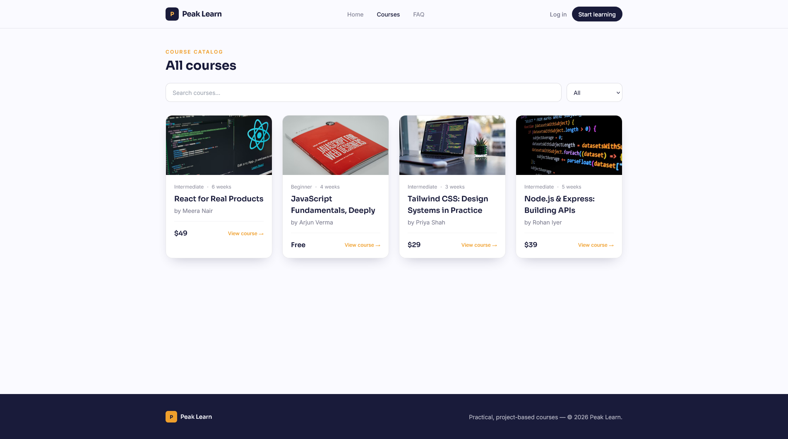
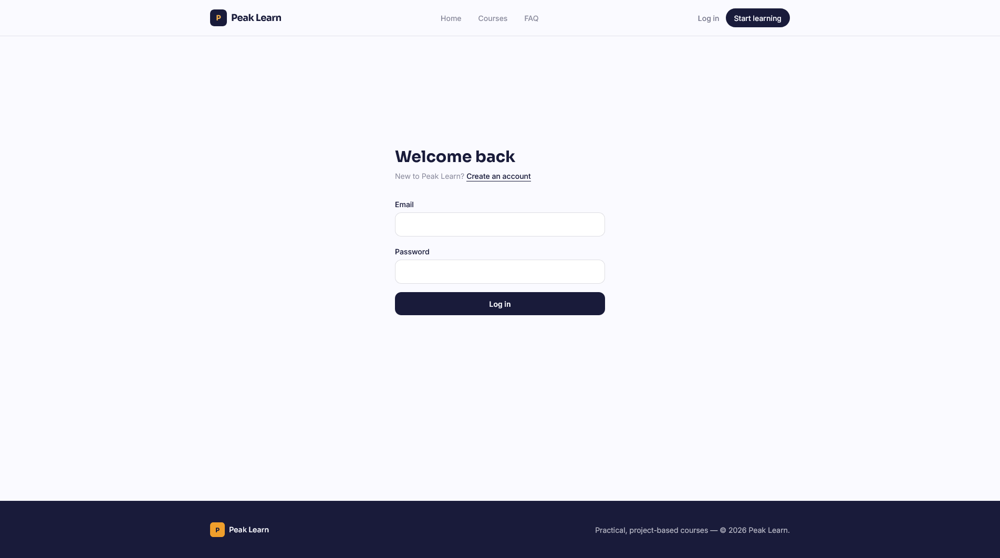
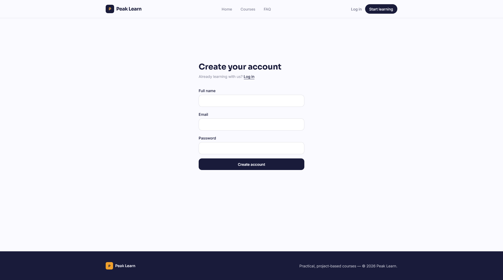
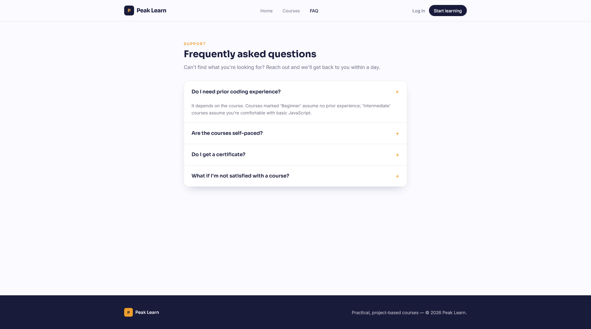

# PeakLearn

PeakLearn is an online learning platform where users can browse courses, view course details, and enroll in courses.

The project was originally built using HTML, CSS, and JavaScript and later rebuilt in React using reusable components.

## Features

- Browse available courses
- Search courses
- Filter courses by level
- View course details
- View course syllabus and instructor information
- Course enrollment
- Login and registration
- Testimonials section
- Interactive FAQ section
- Responsive design for desktop and mobile

## Tech Stack

- React
- JavaScript
- HTML
- CSS
- Tailwind CSS
- React Router
- Vite
- localStorage

## Getting Started

### Prerequisites

Make sure you have the following installed:

- Node.js
- npm
- Git

### Installation

Clone the repository:

    git clone https://github.com/TOGICHARANDEEP/PeakLearn.git

Go to the project folder:

    cd PeakLearn

Install the dependencies:

    npm install

Start the development server:

    npm run dev

Open the local URL shown in the terminal to view the application.

## Future Improvements

- Add a Node.js and Express.js backend
- Add MongoDB for users and courses
- Implement proper server-side authentication
- Add a student dashboard
- Store course enrollments in a database
- Add course progress tracking
- Add video lessons
- Add an instructor dashboard
- Add an admin dashboard
- Add certificates for completed courses
- Add payment integration for paid courses
- Deploy the application

## Screenshots

### Home Page

### Courses Page

### Login Page

### Register Page

### FAQ Page

## Author

Togi Charan Deep

GitHub: https://github.com/TOGICHARANDEEP
